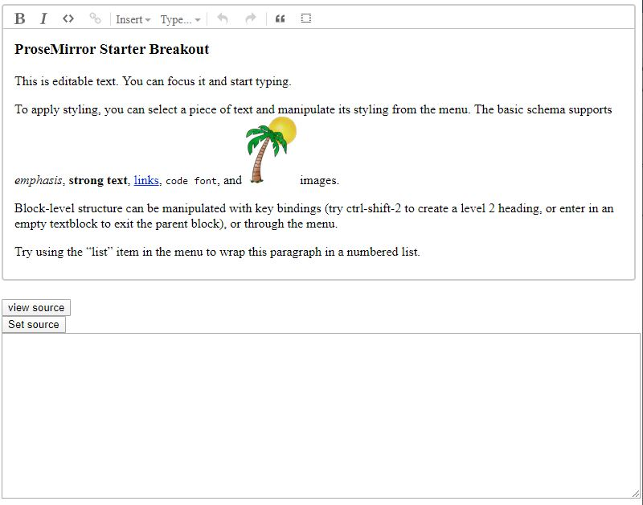
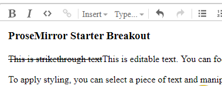
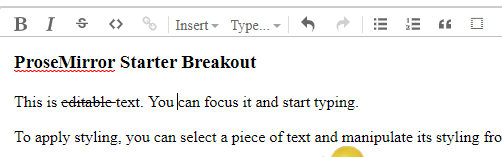

# ProseMirror Breakout Starter Kit
This starter kit is a modified version of the ProseMirror basic example.

## Introduction

It took me awhile to figure out how to get things to work properly using ProseMirror and I am hoping this may help make things a bit easier for some of you.

The ProseMirror-example-setup package used in the basic example makes things real easy to get the basic example up and running, but if you are like me and want to dig in and figure out how to add some functionality it actually feels like it gets in your way until you struggle through all of the documentation until things start to click in your head.

So what this kit does is breaks out some of the code from the basic example, brings in the required CSS file and goes through an example of adding an additional function (in this case a strikethrough button).

## Getting Started

Clone the repository

`git clone https://github.com/mfoitzik/prosemirror-breakout-starter-kit.git`

Change to the code directory

`cd prosemirror-breakout-starter-kit`

launch visual studio code

`code .`

launch a terminal and run npm install

`npm install`

Run the dev server

`npm run start`

View the editor in a browser

go to [http://localhost:9000](http://localhost:9000)

You should be seeing the following:

This is similar to the ProseMirror basic example but it also adds a view source and set source button. This was added just to show how to read content from the editor as well as setting content to the editor.

In the src/index.js file you can view the event handlers for the setbutton and getbutton to see how this is done.

Regarding the “View Source” functionality I added the pretty module to format the read html.

Before we go through the steps of adding functionality let’s discuss a basic concept of ProseMirror. In the example that is running in your browser click on the “View Source” button. The text box below it will show the html source that is parsed by ProseMirror. In the first paragraph add the following after the opening ‘
’ paragraph tag:

`<s>This is strikethrough text</s>`

So the full line should now look like this:

`

<s>This is strikethrough text</s>This is editable text. You can focus it and start typing.

`

Now click on the “Set Source” button.

The editor will display “This is strikethrough text”, but it will not be rendered as strikethrough text. This is because ProseMirror will only handle elements that it is aware of by what is defined in the schema (reference [https://prosemirror.net/examples/schema/](https://prosemirror.net/examples/schema/), [https://prosemirror.net/docs/guide/#schema](https://prosemirror.net/docs/guide/#schema) and [https://prosemirror.net/docs/ref/#schema-basic](https://prosemirror.net/docs/ref/#schema-basic) ). If you click the “View Source” button and view the HTML you will notice that the ‘<s>’ tag that you wrapped the above text in will no longer be there. It was stripped out by ProseMirror because it was an unrecognized tag. (side note: this is actually an awesome feature. If you have ever worked on browser based WYSIWYG editors in the past you will know about problems like pasting from Microsoft Word into the editor and ending up with a bunch of garbage. If you do the same with this basic editor you will notice it ends up reasonably clean).

There are three steps required to add a new function to the editor:

1.  Add an entry to the schema to make the editor aware of the tag (and if necessary, styles)
2.  Add a keyboard shortcut by making an entry in the keymap file
3.  Add a button to the menu

## Add an Entry to the Schema

Open the src/schema/index.js file

Starting on about line 109 there are constants defined for emDOM, strongDOM, and codeDOM. Add the following additional constant definition:

`strikeDOM = ["s", 0]`

So the whole block of code will look like:

<pre>const emDOM = ["em", 0], 
      strongDOM = ["strong", 0], 
      codeDOM = ["code", 0], 
      strikeDOM = ["s", 0]
</pre>

Find the em: entry (at about line 134) and after it add the following:

<pre>s: {
parseDOM: [{tag: "s"}, {style: "text-decoration=line-through"}],
toDOM() { return strikeDOM }
  },
After adding the above this section of the code should look like:
  em: {
    parseDOM: [{tag: "i"}, {tag: "em"}, {style: "font-style=italic"}],
    toDOM() { return emDOM }
  },
  s: {
    parseDOM: [{tag: "s"}, {style: "text-decoration=line-through"}],
    toDOM() { return strikeDOM }
  },
</pre>

In real simple terms the above entry tells ProseMirror that if it finds an ‘<s>’ element or an element with a style that has the text-decoration property set to line-through to return an ‘<s>’ tag (strikeDOM constant).

Save your changes and reload your browser. Now click “View Source” again and add the following text to the source:

`<s>This is strikethrough text</s>`

Now click the “Set Source” button. The editor now supports strikethrough text!

Now in the source text box replace <s>This is strikethrough text</s> with the following:

`This is strikethrough text`

Click on the “Set Source” button and then click on the “View Source” button again. You will notice that the editor parsed the span tag that had the style set to “text-decoration:line-through” and replaced it with the ‘<s>’ tag.

## Add a Keyboard Shortcut

Open the src/js/customSetup/keymap.js file

At around line 67 add the following code:

<pre>if (type = schema.marks.s) {
    bind("Alt-Shift-s", toggleMark(type))
    bind("Alt-Shift-S", toggleMark(type))
  }</pre>

After entering this, that section of code should look like:

<pre>  if (type = schema.marks.em) {
    bind("Mod-i", toggleMark(type))
    bind("Mod-I", toggleMark(type))
  }
  if (type = schema.marks.s) {
    bind("Alt-Shift-s", toggleMark(type))
    bind("Alt-Shift-S", toggleMark(type))
  }
  if (type = schema.marks.code)
    bind("Mod-`", toggleMark(type))</pre>

Save your changes and reload the page. select a word in the editor and then hit Alt-Shift-s on your keyboard and you should notice that the selected text will get the strikethrough. hit Alt-Shit-s again and it will remove it.

## Add a Button to the Menu

At this point we have added functionality to support strikethrough via a keyboard shortcut but let’s add a button to the menu to support it as well.

The images for the button are svg definitions found in src/js/menu/menu.js

One source to find additional icons (assuming you do not want to draw your own from scratch) is google’s Material icons which can be found at:

[https://material.io/resources/icons/?style=baseline](https://material.io/resources/icons/?style=baseline)

Go down to the editor section and you will see a strikethrough image there. Click on it and download the SVG file.

Open the strikethrough SVG in a text editor.

In the src/js/menu/menu.js file go down to the em entry (about line 344) and enter the following after it:

<pre>s: {
	width: 24, height: 24,
	path: "M6.85,7.08C6.85,4.37,9.45,3,12.24,3c1.64,0,3,0.49,3.9,1.28c0.77,0.65,1.46,1.73,1.46,3.24h-3.01 c0-0.31-0.05-0.59-0.15-0.85c-0.29-0.86-1.2-1.28-2.25-1.28c-1.86,0-2.34,1.02-2.34,1.7c0,0.48,0.25,0.88,0.74,1.21 C10.97,8.55,11.36,8.78,12,9H7.39C7.18,8.66,6.85,8.11,6.85,7.08z M21,12v-2H3v2h9.62c1.15,0.45,1.96,0.75,1.96,1.97 c0,1-0.81,1.67-2.28,1.67c-1.54,0-2.93-0.54-2.93-2.51H6.4c0,0.55,0.08,1.13,0.24,1.58c0.81,2.29,3.29,3.3,5.67,3.3 c2.27,0,5.3-0.89,5.3-4.05c0-0.3-0.01-1.16-0.48-1.94H21V12z"
},
</pre>

The above basically copies the path info from the strikethrough svg file downloaded from Google icons.

Open the src/hs/customeSetup/menu.js file

Add the following at about line 169:

<pre>if (type = schema.marks.s)
    r.toggleS = markItem(type, {title: "Toggle strikethrough", icon: icons.s})
	</pre>

Save all your changes and now you’ll see the new strikethrough button showing in the editor.

## Author

Mike Foitzik

## License

This project is licensed under the MIT License - see the [LICENSE](LICENSE) file for details

## Acknowledgments

This project is simply a breakout and repackaging of the ProseMirror basic example. Hats off to [Marijn Haverbeke](https://github.com/marijnh) and all contributors who created and maintain ProseMirror.